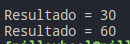
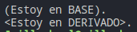
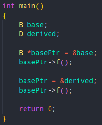

# enlaceDinamico
Ejemplo pracitco de uso de Enlace Dinamico usando C++

---
# Documentacion


## Ejemplo de enlace estatico en C++ (tiempo Compilacion):

- Considere el siguiente código, donde el sum() La función está sobrecargada para aceptar dos y tres argumentos enteros. Aunque hay dos funciones con el mismo nombre dentro del ComputeSum clase, la llamada a la función sum() se une a la función correcta dependiendo de los parámetros pasados a esas funciones. Este enlace se realiza de forma estática durante el tiempo de compilación.

- 

## Ejemplo de enlace dinamico en C++ (tiempo Ejecucion):
-  Considere el siguiente código, donde tenemos una clase ```Base``` y una clase derivada ```Derived```. clase  ```Base``` tiene una función virtual ```func()```, que se reemplaza por una función en la clase ```Derivada```, es decir,```Derivada::func()``` anula ```Base::func()```.

    Ahora considere las líneas 30-34, donde la decisión de qué clase de función será invocada depende del tipo dinámico del objeto apuntado por basePtr. Esta información solo puede estar disponible en el tiempo de ejecución y, por lo tanto, ```func()``` está sujeta a la vinculación dinámica.

- 

---
## Explicacion de ```main()```
- 

    Aquí se define la función principal main(). En primer lugar, se crean dos objetos de las clases Base y Derived. Luego, se crea un puntero a la clase Base llamado basePtr que apunta al objeto base. Se llama a la función virtual func() utilizando este puntero, lo que imprimirá el mensaje "The base class function is called." en la salida estándar.

    A continuación, el puntero basePtr se cambia para que apunte al objeto derived, que es un objeto de la clase derivada Derived. La función virtual func() se llama de nuevo utilizando este puntero, lo que imprimirá el mensaje "The derived class function is called." en la salida estándar.

    Este cambio en el comportamiento de la función virtual se debe a la vinculación dinámica, donde la función que se ejecuta en tiempo de ejecución se determina en función del tipo real del objeto al que se hace referencia mediante el puntero basePtr.

    ---
## Fuentes de consulta:
- > https://www.techiedelight.com/es/difference-between-static-dynamic-binding-cpp/#:~:text=Ejemplo%20de%20enlace%20din%C3%A1mico%20en%20C%2B%2B%3A&text=clase%20base%20B%20tiene%20una,del%20objeto%20apuntado%20por%20basePtr%20.
- > https://www.ibm.com/docs/es/openxl-fortran-aix/17.1.0?topic=fortran-dynamic-static-linking
